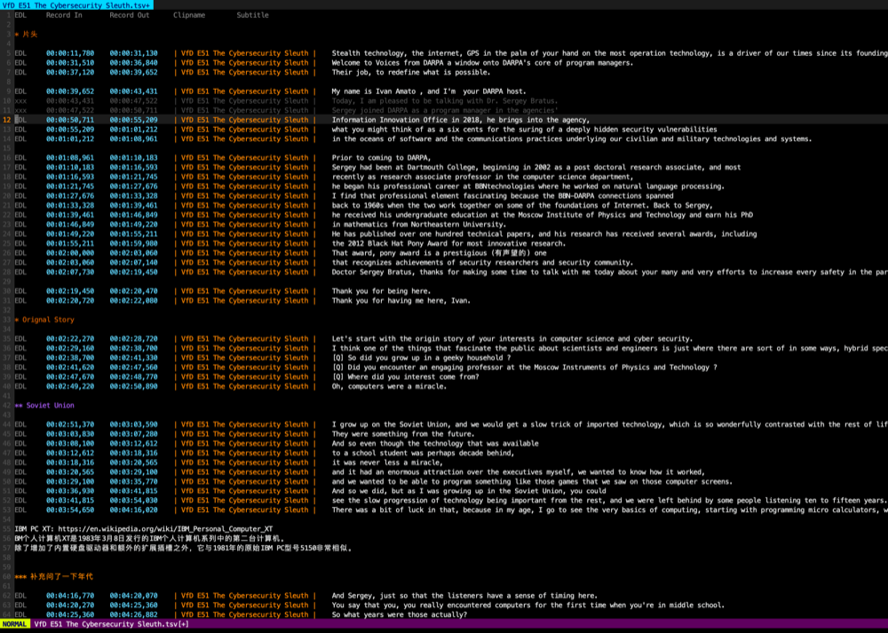
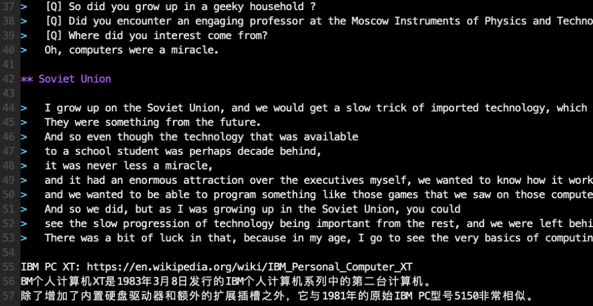

## Overview

```
.srt --- [srt2tsv] --> .tsv file
                       |
		       V
		      Vim: proofread ---- [tsv2srt] ------> .srt file 
		       |                                       \- [audio2srtvideo]
		       |                                                \---> .mkv (with TC)
		       V
		      Vim: add notes and '* Section' '** Subsection'
		       |
		       V
		      Vim: Tab    (Preview)
		       |   Enter  (Select)
		       |   Delete (Reject)
		       |   cherry-pick / re-arrange
		       V 
	       Google Spreadsheet: Invite your editor friends to edit
		       |
		       |
		       \----> selected .tsv file 
		                |       \
				|	 \
			        |     [tsv2edl] --> .edl file
				|                         \
				v  	                   \--> DaVinci Resolve: fine tuning
			 [tsv2roughcut]	                              \
							               \
							                \---> Production
```



## Install

```bash
mkdir -p ~/.vim/pack/plugins/start
cd ~/.vim/pack/plugins/start
git clone https://github.com/scateu/tsv_edl.vim

#install mpv, ffmpeg
# sudo apt install mpv ffmpeg
brew install mpv ffmpeg

make install-utils 
# tsv2edl srt2tsv_all audio2srtvideo tsv2srt tsv2srt_all
```

## .srt to .tsv

```bash
cd /path/to/srt/
srt2tsv_all
```

or: in vim, `:!srt2tsv_all`

or: in vim, `V` to mark a region, and press `:` then type `!srt2tsv`, 
to filter this region through the corresponding util.

## Cherry-pick

```bash
touch selection1.tsv
vim -p selection1.tsv movie1.tsv podcast1.tsv podcast2.tsv movie2.tsv  #target has to be the first tab
```

## Keys

| Key                | Function                                            |
|--------------------|-----------------------------------------------------|
| Enter              | pick this line to Vim Tab 1                         |
| Backspace / Delete | reject this line                                    |
| Tab                | mpv/ffplay this line (guessing start pos at cursor) |
| Shift-Tab          | mpv/ffplay this line from start (no guessing pos)   |
| \ Tab              | mpv/ffplay this line (from cursor) don't stop       |
| Space              | mpv/ffplay from this line till EOF                  |
| J                  | Join (timecode) with the next line                  |
| \|                 | Split this line into two, guessing a new timecode   |
| Shift-Left/Right   | Roll timecode with the previous line for 1 sec      |
| g0                 | go to the start of subtitle                         |
| g8                 | go to `record_out` timecode in prev line            |
| g9                 | go to `record_in` timecode                          |
| go                 | append a gap for 5 secs below current line          |
| V (region) Space   | render those highlighted lines with `tsv2roughcut`  |

<details markdown="1"><summary>Click here to see full description of those keys</summary>

On media files tab, 

Press 'Enter' will:
 - Copy this line to the end of `tab 1`
 - Mark this line as used `---`
 - Move to the next line 

Press `Backspace` or `Delete` will:
 - Mark this line as rejected, mark `xxx` at the head of this line
 - Move to the next line

Press `Space` will:
 - Continous play lines start with `EDL`

<del>
 - Add a newline at the end of `tab 1`
 - Go back to current position
</del>

Press `Tab` will:
 - Invoke `mpv`/`ffplay` the `*clipname*.!(tsv|srt|txt)'` in current directory, starting from time `record_in`
 - Press `q` to stop
 - Will try to infer a playback timecode according to cursor position
    - `Shift-Tab` will bypass position guessing

Press `J` will:
 - Merge with next line, join those two timecode

Press `|` on a character will:
 - Split this line into two. 
 - Will guess out a new timecode in break point, by words length

Press `Shift-Left` or `Shift-Right` will:
 - Shift `Record In` timecode of this line to 1 sec left
 - Shift `Record Out` timecode of previous line to 1 sec left
 - This function is pretty much like 'Roll' operation in Davinci Resolve

Press `g0` will:
 - Go to the head of subtities.

Press `g9` will:
 - Go to `record_in` timecode. You may like this keybinding with `C-a` `C-x` to increase/decrease number.

</details>

*NOTE*: `:mksession` to save a `Session.vim` to the current folder may be very useful before reloading this session with `vim -S`.

## utils

 - audio2srtvideo.sh
 - mkgap_10_mp3
 - mkgap_10_mp4
 - srt2tsv_all
 - tsv2srt
 - tsv2srt_all: perform on all .tsv file in current directory
 - tsv2srt_reflow: reflow timestamp in exported srt file from start
 - tsv2roughcut
 - tsv2edl: to DaVinci Resolve, or Adobe Premiere

## Conceal: Hide the first 4 columns

... to stay more focused when listening to tape.

```
:set conceallevel=1  (or 2)

(for short) 
:set cole=1 
```



## Assemble a timeline

(You may want to change the `FPS` value in `utils/tsv2edl.py`)

    grep EDL selection.tsv | tsv2edl > selection.edl

or with Makefile, you can do `:make` or `:make selection2.edl` or `:make %[Tab Key] [backspace..].edl` within vim.

```makefile
selection.edl: selection.tsv
	grep EDL $< | tsv2edl > $@
```

```makefile
%.edl: %.tsv
	grep EDL $< | tsv2edl > $@
```

Then import the .edl file into Davinci Resolve (Cmd-Shift-i) / Adobe Premiere. 
Or find your way to convert it to .fcpxml

*NOTE*: the starting TC of a source clip needs to be '01:00:00:00'. You may shift the clips in Davinci Resolve, or you change the `utils/tsv2edl.py` accordingly.

*NOTE*: If Davinci Resolve matches a wrong clip, you may create a new bin contains the only clip. Then you import EDL, click done, and in the next window, choose the only new bin.

*NOTE*: If the source slip is a pure audio file, you may create a timeline, lay down the audio file and rename the timeline exactly the same as the clipname. Starting timecode must match.

Or ...

## Convert MP3/Audio to a dummy video from .srt

Due to the limitation of Davinci Resolve that EDL file cannot be reconstructed into a timeline refering to pure audio file, 
a helper bash script is prepared in `utils/audio2srtvideo.sh`

```bash
audio2srtvideo "Some podcast E01.mp3"
```

will yield a `Some podcast E01.mkv`

*NOTE*: You may want to move those mkv files into a subdirectory named, for example, `mkvs`, so that `Tab` key `ffplay` will not be confused.

## See Also

 - sc-im: spreadsheet in terminal
 - http://podcasts.bluepill.life/ a firefox podcast addon, so convenient to download mp3 files
 - REFERENCE 
	- Python vs Vimscript: https://gist.github.com/yegappan/16d964a37ead0979b05e655aa036cad0
	- Vimscript cheatsheet: https://devhints.io/vimscript
 - BBC Paper Edit
 	- https://docs.google.com/presentation/d/1vVe_hgTj6JhLhU2WuZBOWx41ajcKX-8m8Xa0NIVZT2M/edit#slide=id.g6b51b79a88_2_245
 	- https://github.com/bbc/digital-paper-edit-client
 	- https://bbcnewslabs.co.uk/projects/digital-paper-edit/

## TODOs

 - [X] Gap: EDLSPACE?  `go`
 - [ ] When there's only one tab, `Enter` should cease to work. 
 - [X] Tab/Space key on a visual region. render the region into a media file
 - [X] tsv2srt -reflow: reassign the timestamp of each srt block. generate a srt for the rendered region

 ## Known bugs
 - macOS: `set shell=/bin/bash` otherwise, in zsh, error will occur
